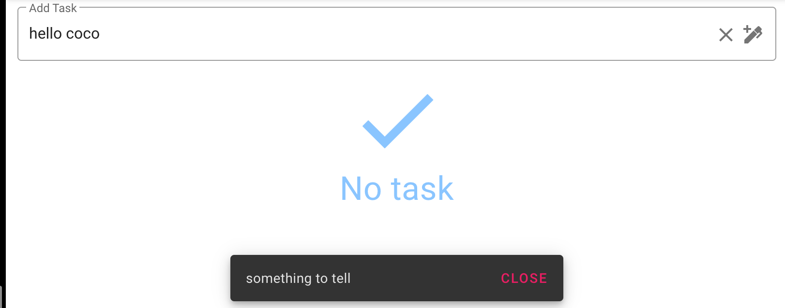

# 06 `snackbar`



On la met dans un dossier `components/shared` car elle peut être disponible pour n'importe quelle page.

On l'inclus dans le `template` général `App.vue` pour que la `snackbar` soit disponible pour toutes les pages.

```html
<v-main>
      <!--  -->
      <router-view></router-view>
      <snack-bar />
    </v-main>
  </v-app>
</template>
```


## Propriété Calculée avec `set` et `get`

Syntaxe

```js
computed: {
  fullName: {
    // accesseur
    get: function () {
      return this.firstName + ' ' + this.lastName
    },
    // mutateur
    set: function (newValue) {
      var names = newValue.split(' ')
      this.firstName = names[0]
      this.lastName = names[names.length - 1]
    }
  }
}

```


## Pour notre `snackbar`

```vue
<template>
  <v-snackbar
      v-model="snackbar"
    >
      {{ $store.state.snackbar.text }}

      <template v-slot:action="{ attrs }">
        <v-btn
          color="pink"
          text
          v-bind="attrs"
          @click="snackbar = false"
        >
          Close
        </v-btn>
      </template>
    </v-snackbar>
</template>

<script>
export default {
    computed: {
        snackbar: {
            get: function() {
                return this.$store.state.snackbar.show
            },
            set: function(value) {
                this.$store.commit('SET_SNACKBAR', value)
            }
        }
    }
}
</script>
```

On peut utiliser `$store.state.snackbarText` directement dans le template car on est en lecture.

Par contre on utilise le pattern proposer par la doc de `Vuex` pour modifier une valeur en `two-way data binding` avec `v-model`.

`store`

```js
export default new Vuex.Store({
  state: {
      tasks: [],
      snackbar:  {
          show: false,
          text: 'hello snackbar !!'
      }
  },
  mutations: {
    // ...
    SET_SNACKBAR(state, snackbar_value) {
        state.snackbar.show = snackbar_value
    },
    CHANGE_SNACKBAR_TEX(state, newText) {
        state.snackbar.text = newText
    }
  },
  // ...
})

```


## Message d'une tâche ajoutée

Il suffit de modifier l'`action` `addTask` dans le `store` :

```js
addTask({ commit, state }, newTaskTitle) {
    if(newTaskTitle) {
        const newTask = { id: Date.now(), title: newTaskTitle, done: false}
        commit('ADD', newTask)
        commit('CHANGE_SNACKBAR_TEX', `new task: ${newTaskTitle}`)
        commit('SET_SNACKBAR', true)
    }
},
```


## Gestion des `snackbar` successive

Il faut d'abord faire disparaître le première `snackbar` avant d'en afficher une nouvelle.

On ne peut mettre d'action asynchrone que dans une `action`.

Une `action` a accès à une autre `action` grâce au passage de `dispatch`.

`store`

```js
export default new Vuex.Store({
  state: {
      tasks: [],
      snackbar:  {
          show: false,
        text: 'hello snackbar !!'
      }
  },
  mutations: {
    // ...
    SET_SNACKBAR(state, snackbar_value) {
        state.snackbar.show = snackbar_value
    },
    CHANGE_SNACKBAR_TEX(state, newText) {
        state.snackbar.text = newText
    }
  },
  actions: {
      
      // ...,
      showSnackbar({ commit, state}) {
          if(state.snackbar.show) {
              commit('SET_SNACKBAR', false)
              setTimeout(function() {
                  commit('SET_SNACKBAR', true)
              },300)
          } else {
              commit('SET_SNACKBAR', true)
          }
      },
      addTask({ commit, dispatch }, newTaskTitle) {
          if(newTaskTitle) {
            const newTask = { id: Date.now(), title: newTaskTitle, done: false}
            commit('ADD', newTask)
            commit('CHANGE_SNACKBAR_TEX', `new task: ${newTaskTitle}`)
            dispatch('showSnackbar')
          }
      },
      removeTask({ commit, state, dispatch }, taskId) {
          
          const taskDeleted = state.tasks.find(task => task.id == taskId)
          commit('CHANGE_SNACKBAR_TEX', `task deleted: ${taskDeleted.title}`)
          dispatch('showSnackbar')
          commit('DELETE', taskId)
      }
  }
})

```

