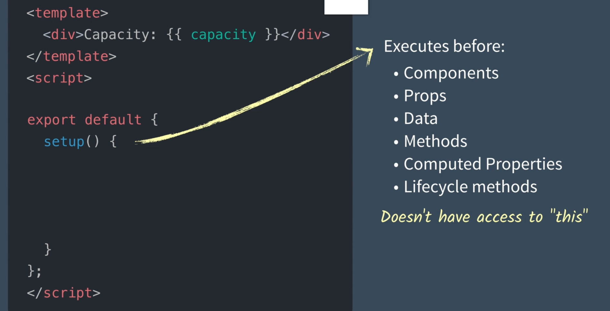

# 00 Introduction Vue 3 Composition API

C'est une syntaxe optionnelle et avancée qui permet de mieux organiser sa logique et réutiliser son code.

## Regular syntaxe

```jsx
<template>
    <div>capacity: {{ capacity }}</div>
</template>
<script>
	export default {
        data() {
            return {
                capacity: 3,
            }
        }
    }
</script>
```

## Composition API syntaxe

```jsx
<template>
    <div>capacity: {{ capacity }}</div>
</template>
<script>
    import { ref } from "vue";
	export default {
        setup() {
            const capacity = ref(3);
            return { capacity };
        }
    }
</script>
```



Pour utiliser `Composition API` avec `Vue 2` il suffit de modifier l'import : `import { ref } from "@vue/composition-api";`.

Il faut aussi le plugin :

https://github.com/vuejs/composition-api
