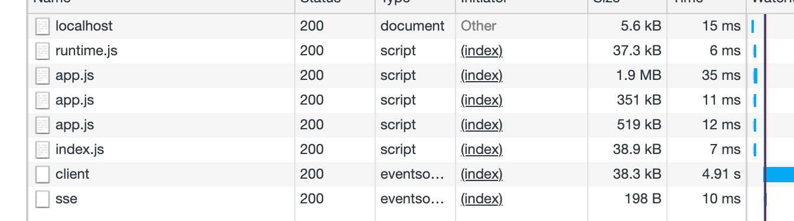

# 02 Créer une page

Pour créer une page dans `Nuxt`, il suffit de créer un composant dans le dossier `pages`.

`Nuxt` s'occupe de créer la route.

`pages/post.vue`

```vue
<template>
  <div class="container">
      <article>
          <h1 class="title">What is Balut ?</h1>
          <p>Lorem ipsum dolor, sit amet consectetur adipisicing elit. Non ad illum voluptate, ex sed et quasi, officia tenetur labore placeat, quam cumque! Deleniti at eligendi esse quae ut labore accusantium eaque fuga maiores eius quisquam accusamus itaque illum, porro quidem mollitia vero voluptates harum qui.</p>
      </article>
  </div>
</template>

<script>
export default {

}
</script>

<style>
/* css here */
</style>
```

On y accède avec l'`url` : `http://localhost:3000/post`.

#### Le routage est généré automatiquement.

Par défaut le code est divisé par page et les fichiers `js` ne sont chargé qu'à la visite d'une `url` et non pas totalement au début :

Pour `localhost:3000`



Pour `localhost:3000/post`


