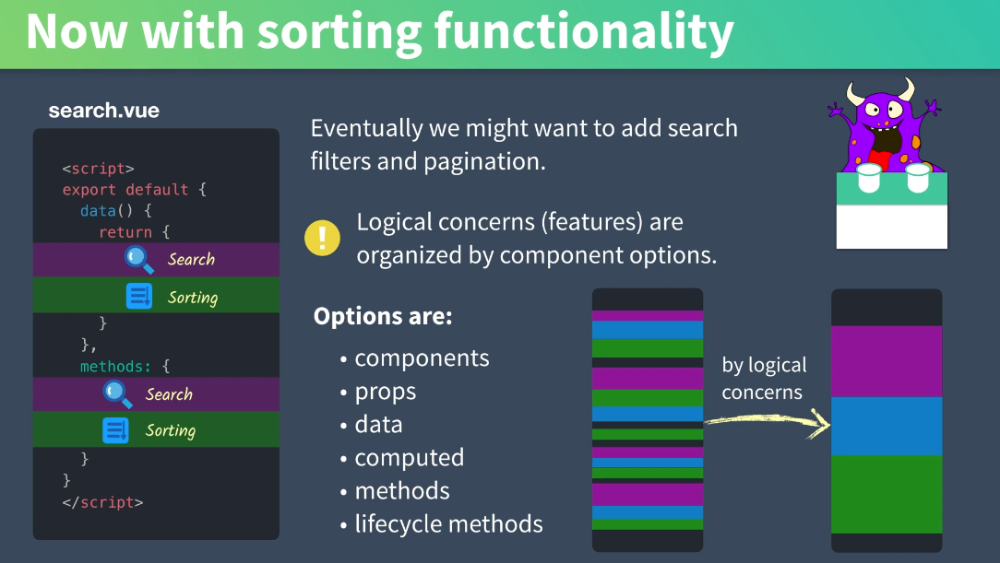
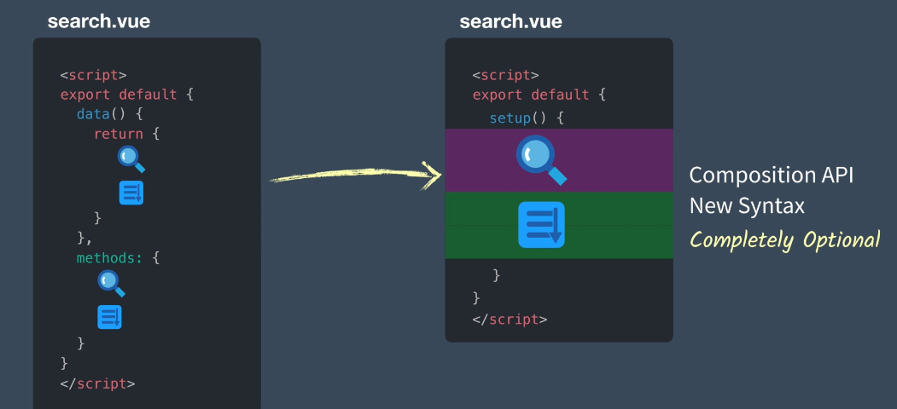
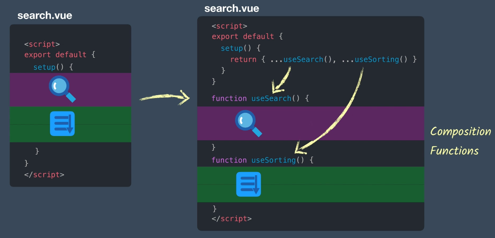
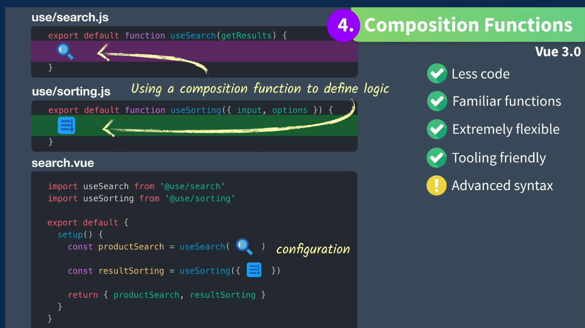

# 01 Pourquoi utiliser la `Composition API`

## premier problème de `Vue 2` l'organisation des blocs logiques

Il y a six options possibles pour écrire de la logique dans un composant `Vue`.

Cela peut avoir comme effet un code brouillon et qui se répète.

On voudrait pouvoir organiser le code par groupes logiques (`logical concerns`).

On veut rendre le composant plus lisible.

On ne va pas écrire une énorme fonction `setup`, mais composer avec des fonctions écrites en dehors du composant.

## Deuxième problème la ré-utilisation du code

Dans `Vue 2` pour ré-utiliser du code on utilise les `mixins`, les `mixins factory` ou les `slots`.

Maintenant avec `Vue 3` on a la composition de fonction.

