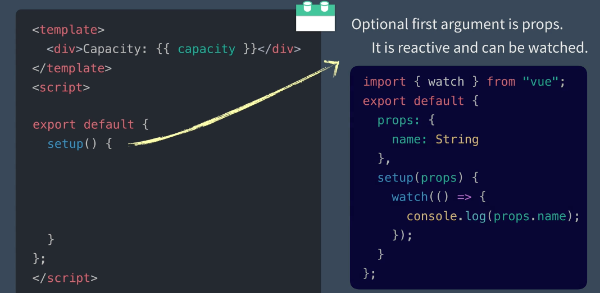
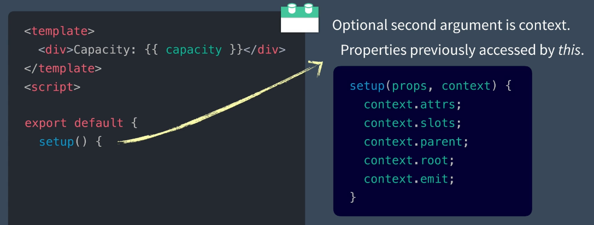
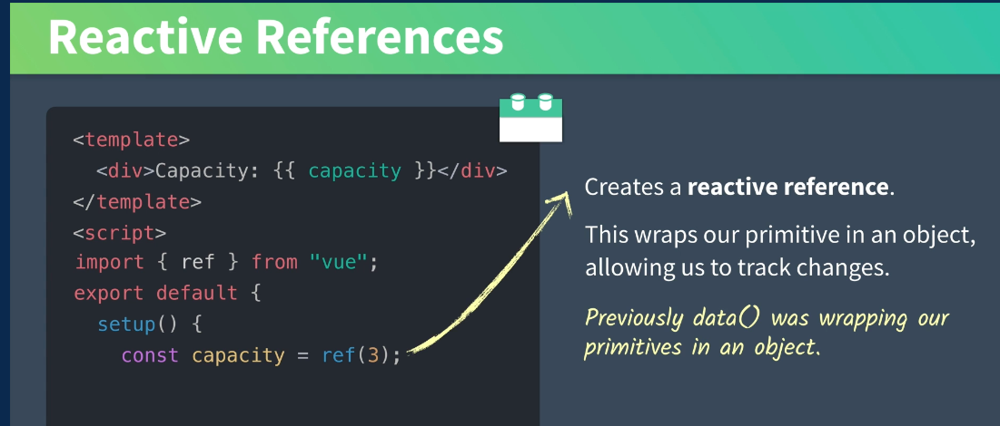

# 02 Comparaison entre la syntaxe classique et la nouvelle

## Syntaxe classique

```vue
<template>
	<div>
        Capacity : {{ capacity }}
    </div>
</template>

<script>
	export default {
        data() {
            return {
                capacity: 3
            }
        }
    }
</script>
```


## Nouvelle syntaxe


`setup` s'exécute avant `components`, `props`, `data`, `methods`, `computed` et les `lifecycle methods`.

Il n'y a pas d'accès à `this` dans `setup`.

`setup` a deux arguments optionnels :

### `props`



C'est un élément `reactive` et il peut être `watché`.


### `context`



C'est l'équivalent de `this`, il permet d'accéder à divers propriétés.


### Reactive Reference

On va utiliser (créer) des références réactive avec `ref(value)`.

Cela encapsule notre valeur primitive dans un objet capable de surveiller les changements.



Finalement `setup` retourne les données devant être accessible dans le template.

```vue
<template>
	<div>
        Capacity : {{ capacity }}
    </div>
</template>

<script>
    import { ref } from "vue"
	export default {
        setup() {
            const capacity = ref(3)
            return { capacity }
        }
    }
</script>
```


