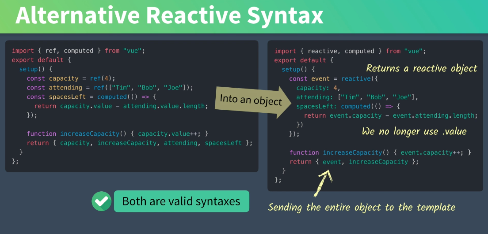
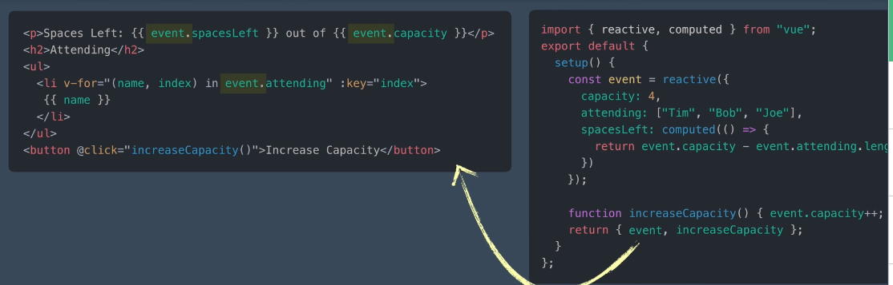
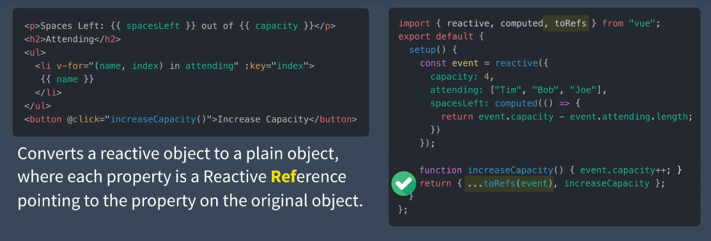

# 05 Syntaxe alternative

On peut utiliser `reactive` pour créer un objet contenant nos données réactives :

```js
import { reavtive, computed } from "vue"

export default {
    setup() {
        const event = reactive({
            capacity: 4, 
            attending: ["john","paul","clara"],
            spacesLeft: computed(() => event.capacity - event.attending.length)
        })
        
        function increaseCapacity() { event.capacity++ }
        
        return { event, increaseCapacity }
    }
```

Plus besoin de la propriété `value` pour accéder à la valeur des données.



Le problème avec cette approche c'est que le template se retrouve avec des `event.somthing` un peu partout :



Si on déstructure l'objet `event` on perd la réactivité.

`Vue 3` offre la solution avec `toRefs`.



Sans `increaseCapacity` on aurait pu simplement écrire :

```js
return toRefs(event)
```


