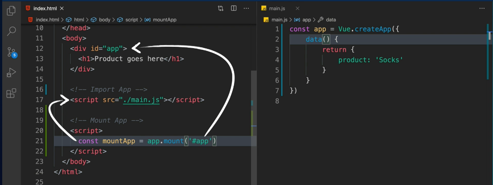
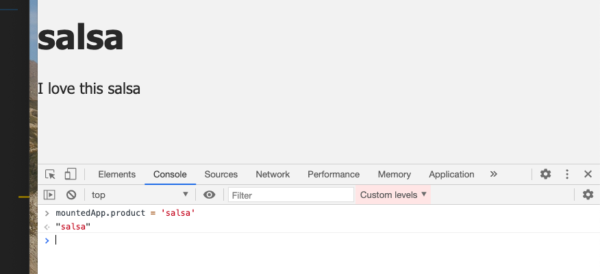

# 01 Introduction à `Vue 3`

## Plugin VSCode

`es6-string-html`

## Prototyper en `vue js` : `CDN`

Pour prototyper facilement en `vue js` avec la dernière version, il suffit d'inclure dans le `html` un lien `CDN` :

```html
<script src="https://unpkg.com/vue@next"></script>
```

### `main.js`

On va créer notre `app` dans `main.js` avec `Vue.createApp` :

```js
const app = Vue.createApp({
  data() {
    return {
      product: 'Socks'
    }
  }
})
```

`data` est une fonction qui retourne un objet contenant les données de l'application (ou du composant).

### `index.html`

on doit ensuite pouvoir placer notre `Vue app` dans le `HTML`, on parle de monter notre `app` :

```html
<script>
	const mountedApp = app.mount('#app')
</script>
```

On a maintenant accès à cette `mountedApp` dans la console.

On peut afficher les données grace à la syntaxe double-accolade : `{{myData}}`

```html
<div id="app">
  <h1>
    {{ product }}
  </h1>
</div>
```




On peut modifier les données passées dans la console grâce à `mountedApp.product`.



`Vue` possède un `Reactivity System` qui lui permet de changer l'affichage lorsque les données changent.
