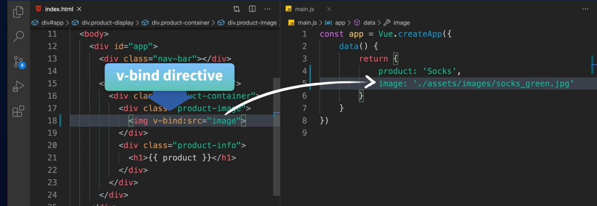
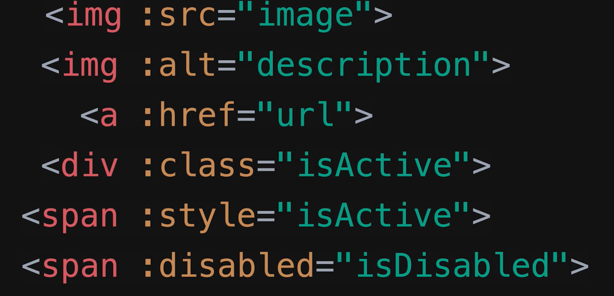

# 02 Binding

## Lier les attributs : Attribute binding `v-bind`



```html

```

```html

```

`v-bind` lie un attribut à une expression.

```html
<div class="product-image">
   0.5 ? image_blue : image_green" />
</div>
<p><a :href="url">google me</a></p>
```

On voie qu'on peut mettre un expression `js` dans le contenu d'un attribut `bindé`.


## Plusieurs cas d'utilisation



