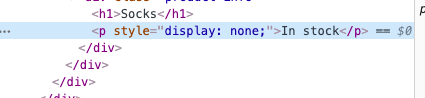

# 03 `v-if`

## Conditional rendering `v-if` `v-else`

```html
<div class="product-info">
  <h1>{{ product }}</h1>
  <p v-if="inStock">In stock</p>
  <p v-else>Out of stock</p>
</div>
```

### `v-show`

Au lieu de retirer l'élément du `DOM`, modifie juste sa visibilité, c'est plus performant si l'élément change souvent d'état (comme une `modal` par exemple).

```html
<p v-show="inStock">In stock</p>
```



On voie que le paragraphe a gagné un nouveau style : `display: none`.

L'élément reste donc dans le `DOM`.

### `v-else-if`

On peut ajouter de la logique avec cette directive.

```html
<p v-if="stock > 10">In stock</p>
<p v-else-if="stock <= 10 && stock > 0">Almost sold out!!</p>
<p v-else>Out of stock</p>
```

##
