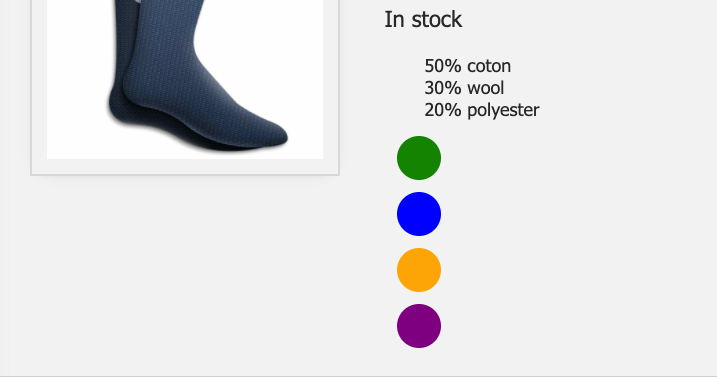
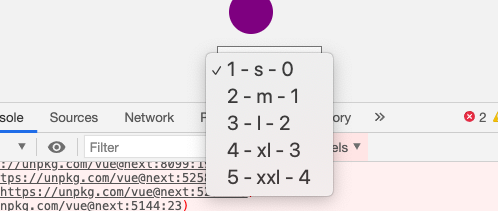

# 04 `v-for`

## Rendre des listes : `v-for`

```html
<ul>
  <li v-for="detail in details">{{detail}}</li>
</ul>
```

On peut utiliser chaque élément du tableau directement dans la balise `html `:

```js
const app = Vue.createApp({
    data() {
        return {
            product: 'Socks',
            image_blue: // ...
            variants: [
                { id: 234, color: 'green' },
                { id: 235, color: 'blue' },
                { id: 236, color: 'orange' },
                { id: 237, color: 'purple' },
            ],
              // ...
```

```html
<div>
  <div
       v-for="variant in variants"
       :key="variant.id"
       class="color-circle"
       :style="`background-color:${variant.color}`"
       ></div>
</div>
```



L'attribut `key` permet de donner un identifiant unique à chaque noeud de la boucle, ce qui améliore les performances.

### `value`, `key` and `index`

Dans le cas d'un objet on peut récupérer la clé :

```js
sizes: {
  s: 1,
  m: 2,
  l: 3,
  xl: 4,
  xxl: 5,
},
```

```html
<select name="" id="">
  <option v-for="value, key, index in sizes" value="">
    {{value}} - {{key}} - {{index}}
  </option>
</select>
```


