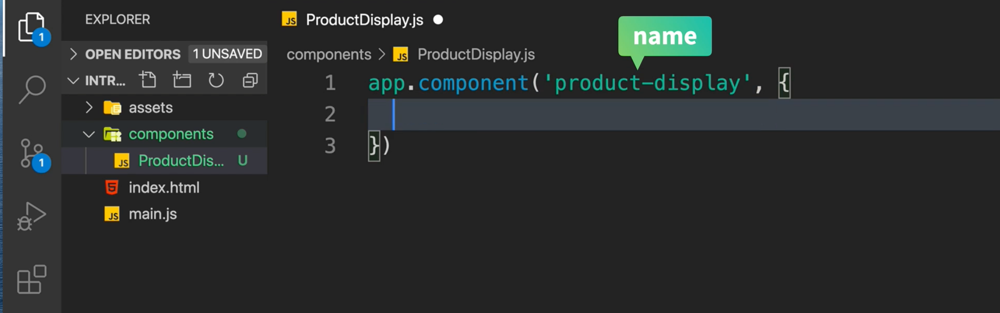
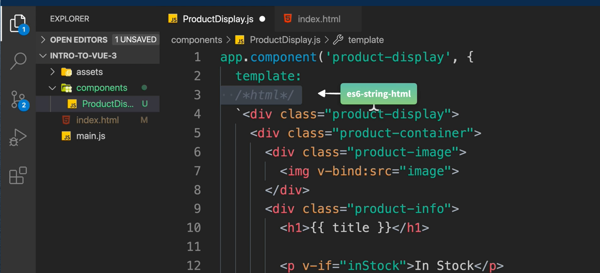
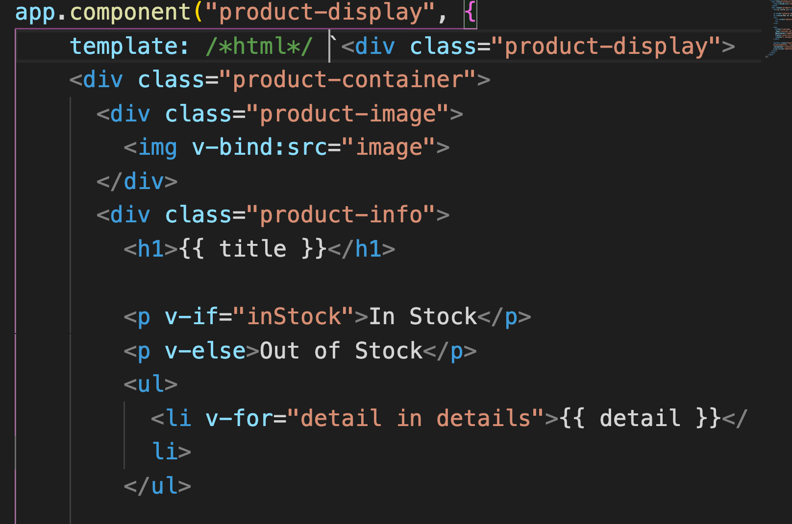
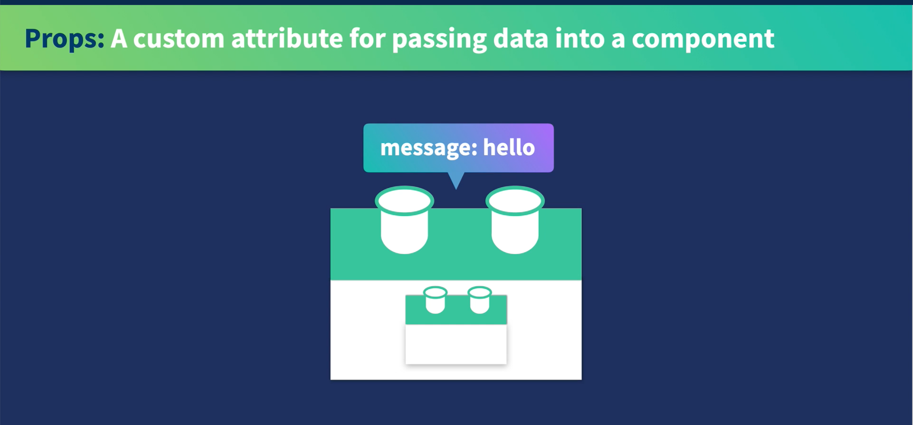
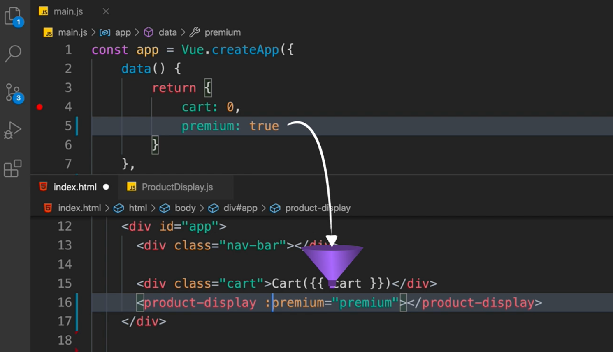

# 08 Composant

On va créer le dossier `components` et dedans notre premier composant : `ProductDisplay.js`





```js
/*html*/
```

active l'extension `es6-string-html`.



## Ajouter les datas et les méthodes

```js
app.component("product-display", {
  template: /*html*/ `<div class="product-display">
    <!-- all the html -->
  </div>`,
  data() {
    return {
      product: "Socks",
      brand: "Vue Mastery",
      selectedVariant: 0,
      details: ["50% cotton", "30% wool", "20% polyester"],
      variants: [
        {
          id: 2234,
          color: "green",
          image: "./assets/images/socks_green.jpg",
          quantity: 50,
        },
        {
          id: 2235,
          color: "blue",
          image: "./assets/images/socks_blue.jpg",
          quantity: 0,
        },
      ],
    };
  },
  methods: {
    addToCart() {
      this.cart += 1;
    },
    updateVariant(index) {
      this.selectedVariant = index;
    },
  },
  computed: {
    title() {
      return this.brand + " " + this.product;
    },
    image() {
      return this.variants[this.selectedVariant].image;
    },
    inStock() {
      return this.variants[this.selectedVariant].image;
    },
  },
});
```

```js
app.component("name-componant", {
  template: `<html>`,
  data() {
    return {
      myData: "value",
    };
  },
  methods: {
    myMethod() {},
  },
  computed: {
    dataComputed() {
      return something;
    },
  },
});
```

## Importer le composant dans le `HTML`

```html
<!-- Import App -->
<script src="./main.js"></script>
<!-- Import Component -->
<script src="./components/ProductDisplay.js"></script>
```

### Utilisation dans le template

```html
<div id="app">
  <div class="nav-bar"></div>

  <div class="cart">Cart({{ cart }})</div>
  <product-display></product-display>
</div>
```

## Props



Pour passer des données à un composant on utilise `props`.



On ajoute la propriété `props` à son composant :

```js
app.component("product-display", {
    props: {
        prenium: {
            type: Boolean,
            required: true,
        }
    },
```

On voit qu'il y a une validation :


Maintenant on passe les propriétés dans le `template` :

```html
<product-display :prenium="prenium"></product-display>
```

et on peut utiliser `prenium` dans son composant :

```jsx
<p>shipping : {{ shipping }}</p>

// ...

computed: {
        // ... ,
        shipping() {
            if (this.prenium) {
                return "free";
            }
            return "2.99";
        },
```

