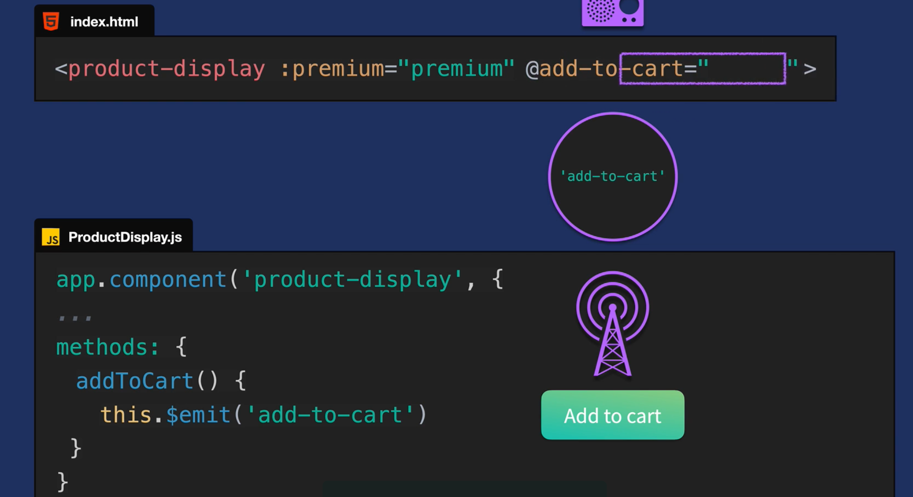
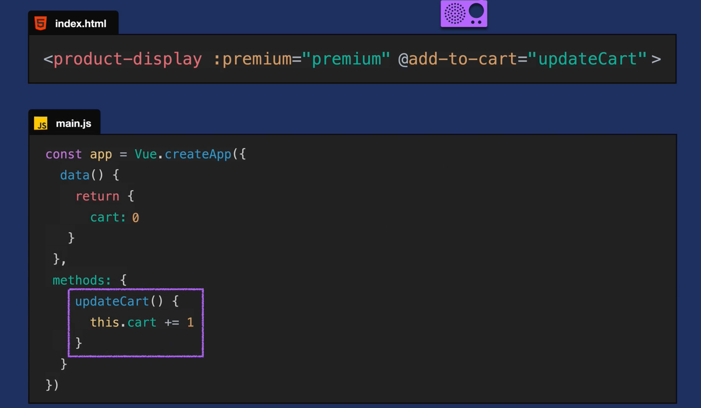
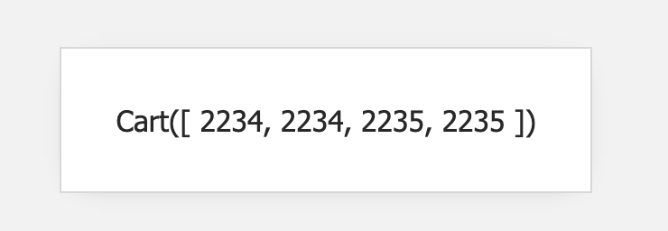

# 09 events

## Communication vers un parent



On emmet un événement avec `$emit` et le parent écoute avec `@add-to-cart`, on passe alors le nom d'une méthode à l'écouteur d'évènement.



## Passer un paramètre

```js
methods: {
    addToCart() {
        this.$emit("add-to-cart", this.variants[this.selectedVariant].id);
    },
```

dans `main.js` :

```js
methods: {
    updateCart(id) {
        this.cart.push(id);
    },
```

Le `cart` affiche maintenant un tableau :



Si on veut plutôt le nombre d'article il suffit d'afficher la longueur du tableau :

```html
<div class="cart">Cart({{ cart.length }})</div>
```


## `RemoveToCart`

```js
removeToCart(id) {
  const index = this.cart.indexOf(id)

  if (index != -1) {
    this.cart.splice(index, 1)
  }
},
```

