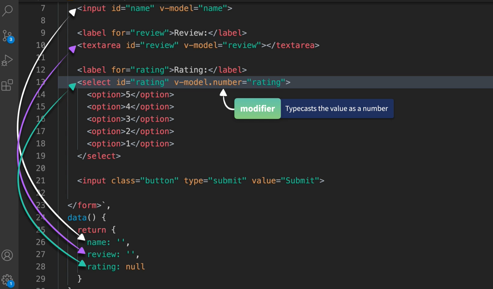
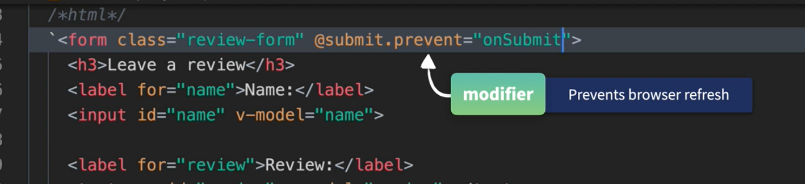
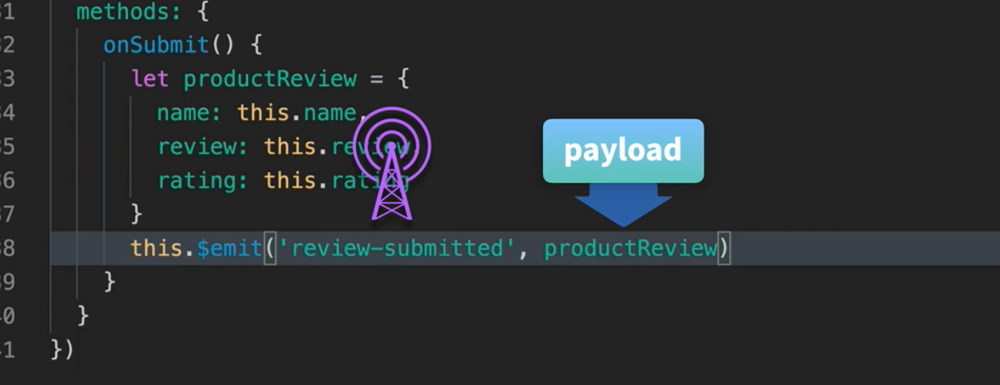

# 10 formulaire

`v-bind` établie une liaison dans un seul sens `one way data binding`.

`data()` -> `component`.

## `v-model`

`v-model` établie une liaison dens les deux sens `two way data binding`.

`data()` -> `component` et `component` -> `data()`.

```jsx
app.component("v-model-demo", {
  template: /*html*/ `
    <p>
        <p>name : {{name}}</p>
        <input type="text" v-model="name">
    </p>`,
  data() {
    return {
      name: "toto",
    };
  },
});
```

## composant formulaire



`v-model.number` cast la valeur en `number`.



`.prevent` est un modificateur qui prévient le comportement par défaut du navigateur.

## envoyer les données du formulaire



On construit un objet litéral et on le transmet avec `$emit`.

### `form`

```jsx
app.component("review-form", {
  template:
    /*html*/
    `<form class="review-form" @submit.prevent="onSubmit">
            <h3>Leave a review</h3>
            <label for="name">Name:</label>
            <input id="name" v-model="name">

            <label for="review">Review:</label>      
            <textarea id="review" v-model="review"></textarea>

            <label for="rating">Rating:</label>
            <select id="rating" v-model.number="rating">
                <option>5</option>
                <option>4</option>
                <option>3</option>
                <option>2</option>
                <option>1</option>
            </select>

            <input class="button" type="submit" value="Submit">
        </form>`,
  data() {
    return {
      name: "",
      review: "",
      rating: null,
    };
  },
  methods: {
    onSubmit() {
      console.log("emitted");
      const productReview = {
        name: this.name,
        review: this.review,
        rating: this.rating,
      };

      this.$emit("review-submitted", productReview);

      // reset
      this.name = "";
      this.review = "";
      this.rating = null;
    },
  },
});
```

### Dans le parent

```jsx
app.component("product-display", {
  // ...
  template:
    /*html*/
    `<div class="product-display">
    		<!-- ... -->
            <review-form v-if="reviews.length" @review-submitted="addReview"></review-form>
          </div>`,
  data() {
    return {
      // ..
      reviews: [],
    };
  },
  methods: {
    // ...
    addReview(review) {
      this.reviews.push(review);
    },
  },
  // ...
});
```

` v-if="reviews.length"` pour n'afficher cet élément que si la liste n'est pas vide.
